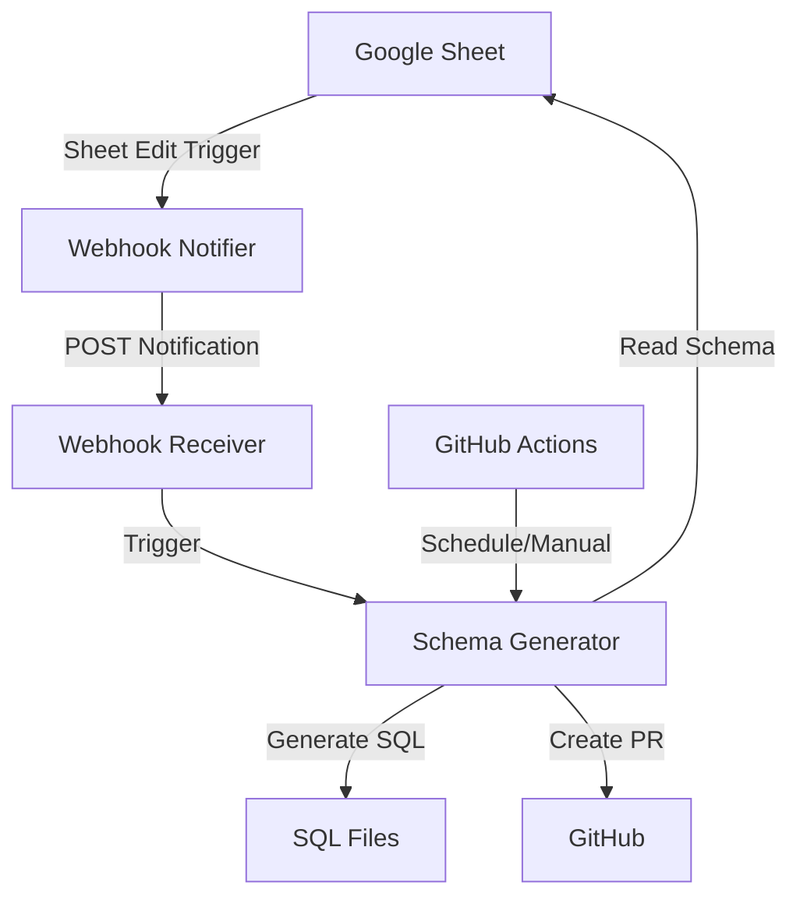

# SheetToSQL

Automatically generate and update SQL schema definitions from Google Sheets specifications. This tool monitors a Google Sheet containing table schemas and generates corresponding SQL DDL statements, creating pull requests with schema changes.

## Architecture



## Prerequisites

### Google Service Account
1. Go to [Google Cloud Console](https://console.cloud.google.com/)
2. Create a new project or select existing one
3. Enable Google Sheets API
4. Create a Service Account:
   - Go to "IAM & Admin" > "Service Accounts"
   - Click "Create Service Account"
   - Fill in name and description
   - Click "Create and Continue"
   - Skip role assignment
   - Click "Done"
5. Create and download JSON key:
   - Click on the service account
   - Go to "Keys" tab
   - Add Key > Create new key > JSON
   - Save the downloaded file
6. Share your Google Sheet with the service account email

### GitHub Access
Choose one:

#### Personal Access Token (PAT)
1. Go to GitHub Settings > Developer settings > Personal access tokens
2. Generate new token (classic)
3. Select scopes:
   - `repo` (full control)
   - `workflow` (if using GitHub Actions)
4. Copy and save the token

#### GitHub App (recommended for organizations)
1. Go to GitHub Settings > Developer settings > GitHub Apps
2. New GitHub App:
   - Set permissions:
     - Repository contents: Read & write
     - Pull requests: Read & write
   - Install on your repositories
3. Save the App ID and generate a private key

## Environment Variables

```bash
# Required
GOOGLE_CREDENTIALS_FILE=/path/to/service-account.json
SHEET_ID=your-google-sheet-id
GITHUB_TOKEN=your-github-pat
GITHUB_REPO=owner/repository
LOCAL_REPO_PATH=/path/to/local/repo

# Optional
BRANCH_PREFIX=schema-update-  # Default: schema-update-
PR_TITLE_PREFIX="Update SQL Schema: "  # Default: "Update SQL Schema: "
```

## Local Setup and Running

1. Clone the repository:
   ```bash
   git clone https://github.com/your-username/sheettosql.git
   cd sheettosql
   ```

2. Create virtual environment (recommended):
   ```bash
   python -m venv venv
   # Windows
   .\venv\Scripts\activate
   # Linux/Mac
   source venv/bin/activate
   ```

3. Install dependencies:
   ```bash
   pip install -r requirements.txt
   ```

4. Set environment variables:
   ```powershell
   # Windows PowerShell
   $env:GOOGLE_CREDENTIALS_FILE="C:\path\to\service-account.json"
   $env:SHEET_ID="your-sheet-id"
   $env:GITHUB_TOKEN="your-github-pat"
   $env:GITHUB_REPO="owner/repository"
   $env:LOCAL_REPO_PATH=$PWD
   ```
   ```bash
   # Linux/Mac
   export GOOGLE_CREDENTIALS_FILE="/path/to/service-account.json"
   export SHEET_ID="your-sheet-id"
   export GITHUB_TOKEN="your-github-pat"
   export GITHUB_REPO="owner/repository"
   export LOCAL_REPO_PATH=$PWD
   ```

5. Run the generator:
   ```bash
   python scripts/generate_sql.py
   ```

## GitHub Actions Setup

1. Go to your repository's Settings > Secrets and variables > Actions
2. Add the following secrets:
   - `GOOGLE_SERVICE_ACCOUNT_JSON`: Full content of the service account JSON file
   - `SHEET_ID`: Your Google Sheet ID
   - `GITHUB_TOKEN`: Automatically provided by GitHub Actions

The workflow will run:
- Daily at 03:00 UTC
- On manual trigger via Actions tab
- On webhook notifications (if configured)

## Sheet Format

Your Google Sheet should follow this format:

1. Each table in a separate sheet/tab
2. First row: Column names
3. Optional metadata rows:
   - Row 2: Column types (e.g., INT, VARCHAR(255), etc.)
   - Row 3: Constraints (e.g., NOT NULL, UNIQUE)
   - Row 4: Additional metadata (e.g., Primary Key, Foreign Key)

Example:
| id | name | email | created_at |
|-|-|-|-|
| INT | VARCHAR(255) | VARCHAR(255) | TIMESTAMP |
| NOT NULL | NOT NULL | UNIQUE | NOT NULL |
| Primary Key | | | |

## Running Tests

1. Install test dependencies:
   ```bash
   pip install -r requirements-test.txt
   ```

2. Run tests:
   ```bash
   pytest
   ```

3. Run tests with coverage:
   ```bash
   pytest --cov=scripts tests/
   ```

## Troubleshooting

### Common Issues

1. **Authentication Errors**
   - Verify Google service account JSON is correct
   - Ensure sheet is shared with service account email
   - Check GitHub token has required permissions

2. **Sheet Access Issues**
   - Confirm sheet ID is correct
   - Verify sheet/tab names match expected format
   - Check service account has viewer access

3. **Git/GitHub Issues**
   - Ensure local repo path is correct
   - Verify GitHub token hasn't expired
   - Check repository permissions

4. **SQL Generation Errors**
   - Validate sheet format follows requirements
   - Check column type specifications
   - Review constraint definitions

### Logging

The tool creates detailed logs in:
- `logs/generator.log`: Main application logs
- `logs/sheet_edits.log`: Sheet edit webhook logs

Set `DEBUG=1` environment variable for verbose logging.

### Support

For issues and feature requests, please:
1. Check the issue tracker
2. Review existing pull requests
3. Open a new issue with:
   - Environment details
   - Relevant logs
   - Steps to reproduce
   - Expected vs actual behavior

## Contributing

1. Fork the repository
2. Create a feature branch
3. Add tests for new functionality
4. Submit a pull request

## License

MIT License - See LICENSE file for details

SheetSql is an automated tool that syncs Google Sheets data to SQL databases, using LLM-powered schema optimization and version control.

## Features
- Automated Google Sheets to SQL schema conversion
- LLM-powered SQL optimization and validation
- Automated Git versioning and PR creation
- GitHub Actions integration for scheduled syncs

## Setup

1. Clone the repository:
```bash
git clone https://github.com/rkramkumar2000/Ram.git
cd Ram
```

2. Install dependencies:
```bash
pip install -r requirements.txt
```

3. Set up environment variables:
   - Copy `.env.example` to `.env`
   - Configure the following variables:
     - `GOOGLE_CREDENTIALS_FILE`: Path to Google Sheets API credentials
     - `SPREADSHEET_ID`: Your Google Spreadsheet ID
     - `OPENAI_API_KEY`: Your OpenAI API key
     - `GITHUB_TOKEN`: GitHub personal access token
     - `GITHUB_REPO`: Repository in format "owner/repo"
     - Database configuration variables

4. Configure Google Sheets API:
   - Create a project in Google Cloud Console
   - Enable Google Sheets API
   - Create service account credentials
   - Share your spreadsheet with the service account email

## Usage

Run the schema sync manually:
```bash
python -m scripts.generate_sql
```

The tool will:
1. Read data from Google Sheets
2. Generate optimized SQL schema
3. Create SQL migration files
4. Commit changes and create a PR

## GitHub Actions

The repository includes a GitHub Action that runs the sync daily. To enable it:

1. Add required secrets to your GitHub repository
2. Configure the schedule in `.github/workflows/sql-sync.yml`

## Contributing

Pull requests are welcome! Please ensure tests pass before submitting.

## License

MIT
